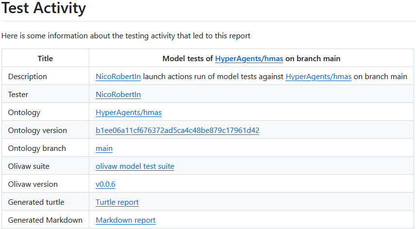
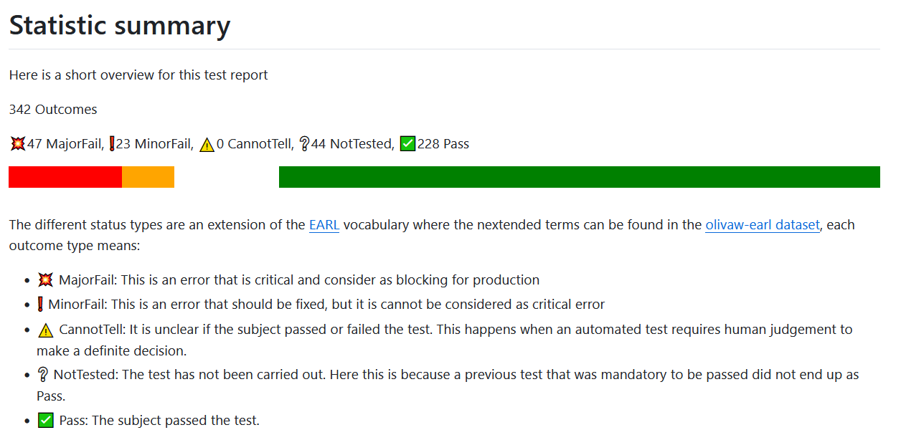
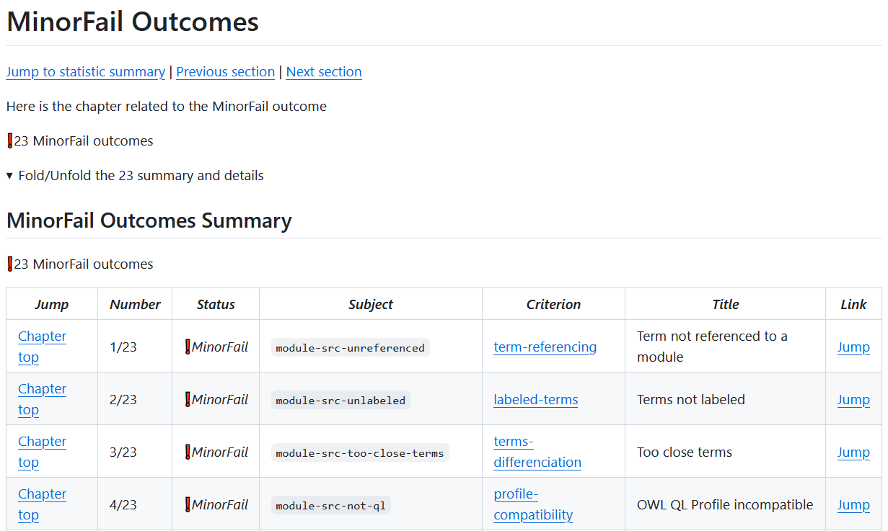
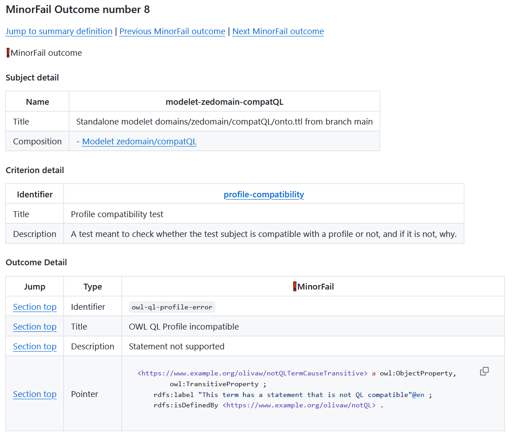

# Tests documentation


Many tests are made using this framework. This document is meant to describe:

* the output formats available for the report
* the tests that are run and for each of them
    * its description
    * the possible errors that this test can encounter

These tests are powered by Corese, check their [website](https://project.inria.fr/corese/) and [repository](https://github.com/Wimmics/corese)

# Table of contents

1. [Outputs formats](#1-output-formats)<br/>
&emsp;1.1. [Turtle format](#11-turtle-format)<br/>
&emsp;&emsp;1.1.1. [The assertor](#111-the-assertor)<br/>
&emsp;&emsp;1.1.2. [The subject](#112-the-subject)<br/>
&emsp;&emsp;1.1.3. [The criterion](#113-the-criterion)<br/>
&emsp;&emsp;1.1.4. [The result](#114-the-result)<br/>
&emsp;&emsp;1.1.5. [The outcome](#115-the-outcomes)<br/>
&emsp;1.2. [Markdown format](#12-markdown-format)<br/>
&emsp;&emsp;1.2.1. [The test context](#121-test-context)<br/>
&emsp;&emsp;1.2.2. [The statistic summary](#122-statistic-summary)<br/>
&emsp;&emsp;1.2.3. [The details for outcomes](#123-details-for-outcomes)<br/>
2. [Available tests](#2-available-tests)<br/>
&emsp;2.1. [Model tests](#21-model-tests)<br/>
&emsp;&emsp;2.1.1. [syntax](#211-syntax)<br/>
&emsp;&emsp;2.1.2. [owl-rl-constraint](#212-owl-rl-constraint)<br/>
&emsp;&emsp;2.1.3. [term-referencing](#213-term-referencing)<br/>
&emsp;&emsp;2.1.4. [domain-and-range-referencing](#214-domain-and-range-referencing)<br/>
&emsp;&emsp;2.1.5. [terms-differenciation](#215-terms-differenciation)<br/>
&emsp;&emsp;2.1.6. [labeled-terms](#216-labeled-terms)<br/>
&emsp;&emsp;2.1.7. [profile-compatibility](#217-profile-compatibility)<br/>
&emsp;2.2. [Data tests](#22-data-tests)<br/>
&emsp;&emsp;2.2.1. [syntax](#221-syntax)<br/>
&emsp;&emsp;2.2.2. [owl-rl-constraint](#222-owl-rl-constraint)<br/>
&emsp;&emsp;2.2.3. [term-recognition](#223-term-recognition)<br/>
&emsp;&emsp;2.2.4. [namespace-validity](#224-namespace-validity)<br/>
&emsp;2.3. [Data tests](#23-query-tests)<br/>
&emsp;&emsp;2.3.1. [syntax](#231-syntax)<br/>
&emsp;&emsp;2.3.2. [query-type](#232-query-type)<br/>
&emsp;&emsp;2.3.3. [uri-validity](#233-uri-validity)<br/>
&emsp;&emsp;2.3.4. [namespace-validity](#234-namespace-validity)<br/>
3. [References](#3-references)


# 1. Output formats

Two output formats are available for now in order to read a test report:

* turtle, a format meant for describing a RDF graph in a simplified way. This report is meant to be *machine readable*
* markdown, a format that is meant to be processed by a markdown vizualizer. This report is meant ot be *human readable*

The markdown format is made out of the turtle report and the [test resource dataset](../olivaw/test/olivaw-earl.ttl).

Let's go deeper into details concerning each of these formats

## 1.1. Turtle format

This is the format that was chosen in the first place for exporting data since it provides the flexibility the graphs can provide, the many standard vocabularies that can be found, and finally because it opens the possibility in the future to store these graph reports in order to track a file/a test/a bug/anything through time and make statistics.

The chosen vocabulary for representing these report was [EARL](https://www.w3.org/TR/EARL10/)

In order to understand the representation of your report, let's have a very short introduction to this vocabulary.

In this vocabulary, an assertion is the conjonction between 4 éléments:

* An assertor, the one doing the test
* A subject, the resource being tested
* A criterion, the criteria that is tested on the subject
* A result, what is the conclusion of the test lead by the asserter on this resource given the criterion

Therefore in this report you should see the assertions this way:

```turtle
[] a earl:Assertion ;
    earl:assertedBy _:theAssertor ;
    earl:result [ a earl:TestResult ; ... we will see later the content ...] ;
    earl:subject _:theSubject ;
    earl:test olivaw-earl:theTestCriterion .
```

Now we can see more in details how is expressed each part

### 1.1.1. The assertor

The assertor, here always a human being using a software tool, is expressed in a similar way than in the [EARL vocabulary guide](https://www.w3.org/WAI/ER/EARL10/WD-EARL10-Guide-20120125#example307), except we prefer to use the term `foaf:OnlineAccount` instead of `foaf:Group`

The assertor declaration should follow this structure:

```turtle
_:{MyDeveloperName} a foaf:Person ;
    schema:mainEntityOfPage <https://github.com/{MyDeveloperName}> .

_:{MyDeveloperName}-{triggerType} a foaf:OnlineAccount ;
    dcterms:date "2024-02-06T11:38:05.750685"^^xsd:dateTime ;
    dcterms:description "Test triggered by @{MyDeveloperName} by {triggerType} trigger"@en ;
    dcterms:title "{MyDeveloperName} using {triggerType} script"@en ;
    earl:mainAssertor _:{MyDeveloperName} ;
    foaf:member <https://github.com/Wimmics/olivaw/blob/main/olivaw/test/{testType}/suite.py> .
```

### 1.1.2. The subject

A subject here is represented with 3 components:

* the parts, the files that are being tested as a subject
* an identifier that is attributed to this subject given its parts
* A title describing what is this subject

An example of subject structure would be:

```turtle
_:file1-file2 a earl:TestSubject ;
    dcterms:hasPart <https://github.com/org/repo/blob/path/to/file1> , <https://github.com/org/repo/blob/path/to/file2> ;
    dcterms:identifier "file1-file2" ;
    dcterms:title "Merged fragments file1 and file 2"@en .
```

### 1.1.3. The criterion

The criterions are all references to the [olivaw earl dataset](https://github.com/Wimmics/olivaw/blob/main/olivaw/test/olivaw-earl.ttl#)

Therefore they are mentioned in the report in a form such as `olivaw-earl:syntax`, for the syntax criterion, represents the uri `https://github.com/Wimmics/olivaw/blob/main/olivaw/test/olivaw-earl.ttl#syntax`

In the acimov earl dataset, each test subject has 3 components:

* an identifier
* a title
* a description

For example the syntax criterion is defined this way in the olivaw-earl dataset:

```turtle
:syntax a earl:TestCriterion ;
    dcterms:identifier "syntax" ;
    dcterms:title "Syntax test"@en ;
    dcterms:description "A test meant to check wether the test subject is syntaxically correct or not."@en .
```

### 1.1.4. The result

A result can point to several different problems that can have different severity levels, causes and places to fix.

Each of these problems are named *outcomes* and a result is an aggregation of outcomes

Then a result is represented this way:

```turtle
[
    a earl:TestResult ;
    earl:outcome [
        a acimov-model-test:MinorFail ;
        dcterms:identifier "the-error-identifier" ;
        dcterms:title "OWL QL Profile incompatible" ;
        dcterms:description "Class Expression not supported with rdfs:subClassOf" ;
        earl:info """ ... some turtle code ... """ ;
        earl:pointer <any.interesting.uri>
    ] , [
        ... content for outcome 2 ...
    ]
]
```

### 1.1.5. The outcomes

An outcome has different properties we will introduce in this section.

**Outcome type**

First an outcome will always be from a given subset of outcome that will represent the semantics of that outcome.

In the EARL vocabulary, the following outcome types are available:

* `earl:Pass`: This outcome denotes that the test on the subject raised no problem. When a test has no problem, the assertion will have only one outcome that is of type `earl:Pass`
* `earl:CannotTell`: This outcome denotes that something unexpected was detected by the test, but a human being must look more precisely whether it's an error or not
* `earl:NotTested`: This outcome means that the test could not be run because some requirements needed for this test was not fulfilled. If a test could not be run, the assertion will have only one outcome of type `earl:NotTested`
* `earl:Fail`: This outome denotes that a problem was detected, that is defenitely an error, and that made this test not passed

In order to add more expressivity to denote the severity of an error, in the [olivaw-earl dataset](../olivaw/test/olivaw-earl.ttl), the `earl:Fail` set was partionned into two subsets:

* `olivaw-earl:MinorFail`: An error is detected but is not considered as blocking for production
* `olivaw-earl:MajorFail`: An error is detected and is considered blocking for production

In our test report you should see the different available outcome types:

* `earl:Pass`
* `earl:CannotTell`
* `earl:NotTested`
* `olivaw-earl:MinorFail`
* `olivaw-earl:MajorFail`

**Title**

The title of the outcome that was taken from the [Test error resource file](../olivaw/constants/tests-resources.json).

The title is set with a `dcterms:title` property.

**Description**

A more detailed explanation of the reason behind this outcome.

The description is set with a `dcterms:description` property.

**Pointer**

Optional. When one of several pointers are set on an outcome, point to either a URI that is problematic for this test, either a text containing some turtle code at the origin of the error.

## 1.2. Markdown format

This format is an export from the previous [turtle format](#turtle-format) with some extra information from the [olivaw-earl dataset](../olivaw/test/olivaw-earl.ttl).

Let's see each section in detail.

### 1.2.1. Test Context

This section is here to remind information and provide URIs about the assertor

* which developper launched the test
* how the tests were launched
* the script that run the tests
* when the test occured



### 1.2.2. Statistic summary

This section is an overview of the test reports.

It provides some basic statistics:

* The total number of outcomes
* The number of assertion for each outcome type
* A simple bar representing each percentage of outcome type

Then you have a short explanation for the meaning behind each outcome type.



### 1.2.3. Details for outcomes

Then a sequence of sections follow, all with the same structure. Each of them correspond to an outcome type and will provide details for the outcomes of that type.

Such a section begins by reminding the number of outcomes of that type.

Then the section provides a foldable section for more readability. This foldable section contains:
* A first table referencing the summaries of all the outcomes for that type
* A sequence of detailed explanation for each 

The summary table is a table where each line is a summary containing the following column:

* at least line a link to get back to the top of the table
* the current outcome number out of the total number of outcome of that type
* the outcome type
* the subject identifier
* the criterion identifier (linked to its definition in the [olivaw-earl dataset](../olivaw/test/olivaw-earl.ttl))
* the outcome title
* the link to the detailed explanation



After this summary table, for each outcome we have a subsection containing the detailed explanation.
There is also one link at the top of this section to get back the summary table at the exact line where the outcome summary is.

This explanation provides:

* a table explaining the subject containing:
  * the subject identifier
  * the title of the subject
  * the list of the different files of the subject that links to their related GitHub page
* a table explaining the criterion containing:
  * the criterion identifier
  * the title of the criterion
  * the description of the criterion
* a table explaining the outcome containing:
  * the status type
  * the outcome title
  * the outcome description
  * eventally one to several URIs and turtle code snippets pointing to the code part causing the error



# 2. Available tests

This section is meant to list all the tests that are processed by this tool

For each of them you should have also some information about the different errors that can be detected during each of them

Some errors can provide *pointers*, either URIs or some textual content that should help you to find where is the error located in the subject

## 2.1. Model tests

This section is meant to enumerate the tests being processed during the model tests

These tests only apply on the following subjects:

* the modules (all the turtle files that can be found in the `src/` folder)
* the modelets (all the `domains/*/*/onto.ttl` files)
* the modules with some merged terms from a given modelet
* the **valid** modules all merged together
* the **valid** modules and the modelets all merged together

Here **valid** means a module or modelet:
* that is syntaxically correct
* with no OWL constraint violation
* with both of the previous conditions applicable to its recursive imports (see `owl:import` in tht [documentation](https://www.w3.org/TR/owl-guide/#OntologyHeaders))

This **valid** definition is meant for these two last tests not to be inapplicable if one singlere error exists in one fragment.

Some projects or developpers may have specific needs like skipping some tests, some subjects of tests, or skipping a combination of tests and subjects. The `.acimov/parameters.json` can help for this, so check the [parameters.json documentation](./parameters.md) for more details.

Some projects would also need some test that cannot be covered by the default olivaw model tests. It is possible to add some custom model tests that will also be treated during the model tests, check the [custom tests documentation](./custom-tests.md) for more details.

Then let's see which tests are made on all of these subjects

### 2.1.1. syntax

This test checks if the turtle syntax of the subject is correct.

|id|syntax|
|-|-|
|title|Syntax test|
|description|A test meant to check wether the test subject is syntaxically correct or not|

**Possible errors:**

* **syntax-error**

|id|syntax-error|
|-|-|
|title|Test subject has syntax errors|
|description|The subject has turtle syntax errors|

### 2.1.2. owl-rl-constraint

This test is meant to test if no OWL RL constraint have been violated

This does not mean that the scope here is to check if the subject is included in OWL RL.

This is a test meant to check if the subject has any logical failure that can be found by a OWL RL reasoner.

One example of an OWL RL violation is: Is there any class that is a subclass of two other disjoint classes?

To have the complete list, check the [OWL RL axioms features](https://www.w3.org/TR/owl2-profiles/#Reasoning_in_OWL_2_RL_and_RDF_Graphs_using_Rules), the constraints are all the lines from the tables 4 to 9 that have a *false* in the *then* column.

|id|owl-rl-constraint|
|-|-|
|title|OWL RL Constraint violation test|
|description|The error message that was provided by Corese as output|

**Possible errors:**

* **owl-rl-constraint-violation**

|id|owl-rl-constraint-violation|
|-|-|
|title|OWL RL Constraint violation|
|description|The fragment violates at least one OWL RL constraint|
|pointer|Corese error output|

### 2.1.3. term-referencing

This test checks if each defined term if the ontology is linked to a module by a `rdfs:isDefinedBy` property (please check the [documentation](https://www.w3.org/TR/rdf-schema/#ch_isdefinedby))

|id|term-referencing|
|-|-|
|title|Term referencing test|
|description|Test checking if each term is linked to a module through a rdfs:isDefineBy property|

**Possible errors:**

* **no-reference-module**

|id|no-reference-module|
|-|-|
|title|Term not referenced to a module|
|description|Subject terms not linked to a module by a rdfs:isDefinedBy property|
|pointer|Term definition of the subject code containing the related term definition|
|pointer|Another definition of the subject code containing the related term definition|

### 2.1.4. domain-and-range-referencing

This test is meant to check if each property that has a `rdfs:domain` or `rdfs:range` (see the documentation for [rdfs:domain](https://www.w3.org/TR/rdf-schema/#ch_domain) and [rdfs:range](https://www.w3.org/TR/rdf-schema/#ch_range))

This test does not force to set a `rdfs:domain` and a `rdfs:range` for each property of the ontology.

It just just checking that, when a `rdfs:domain` or a `rdfs:range` is set on an ontology property, then it should point to another ontology term.

|id|domain-and-range-referencing|
|-|-|
|title|Domain or range out of vocabulary|
|description|Test checking if each range of domain of any property is defined within the fragment|

**Possible errors:**

* **domain-out-of-vocabulary**

|id|domain-out-of-vocabulary|
|-|-|
|title|Domain out of vocabulary|
|description|Some properties have a domain out of the ontology|
|pointer|Definition of a subject ontology term that has a domain out of vocabulary|
|pointer|The URI that is out of vocabulary|
|pointer|Definition of another subject ontology term that has a domain out of vocabulary|
|pointer|The URI that is out of vocabulary|

* **range-out-of-vocabulary**

|id|range-out-of-vocabulary|
|-|-|
|title|Range out of vocabulary|
|description|Some properties have a domain out of the ontology|
|pointer|Definition of a subject ontology term that has a range out of vocabulary|
|pointer|The URI that is out of vocabulary|
|pointer|Definition of another subject ontology term that has a range out of vocabulary|
|pointer|The URI that is out of vocabulary|

### 2.1.5. terms-differenciation

This test checks if all the terms of the subject are different from each other from a spelling point of view.

In order to achieve this, each pair of ontology term is compared using the Levenshtein distance.

Then, those pairs that have a distance under the defined parameter `term_distance_threshold` from the `parameters.json` file (see the [paremeters.json documentation](./parameters.md)) raise an error.

|id|terms-differenciation|
|-|-|
|title|Test of terms differenciation|
|description|Test checking if each term of the subject have a Levenshtein distance high enough from each other|

**Possible errors:**

* **too-close-terms**

|id|too-close-terms|
|-|-|
|title|Too close terms|
|description|Some terms are too similar|
|pointer|Turtle definition of the first term of the first pair that is concerned|
|pointer|Turtle definition of the second term of the first pair that is concerned|
|pointer|Turtle definition of the first term of the next pair that is concerned|
|pointer|Turtle definition of the second term of the next pair that is concerned|

### 2.1.6. labeled-terms

This test checks if the terms of the ontology all have a `rdfs:label` property (check the [documentation](https://www.w3.org/TR/rdf-schema/#ch_label)) pointing to a literal in English.

|id|labeled-terms|
|-|-|
|title|Term labeling test|
|description|Test checking if all the terms defined in the subject have at least a rdfs:label pointing to a literal in English|

**Possible errors:**

* **not-labeled-term**

|id|not-labeled-term|
|-|-|
|title|Terms not labeled|
|description|The following terms have no rdfs:label to define it in natural language|
|pointer|Turtle definition of a term that is concerned|
|pointer|Turtle definition of another term that is concerned|

### 2.1.7. profile-compatibility

This test checks if the subject is compatible with each of the following OWL profiles (check the definition of a [OWL profile](https://www.w3.org/TR/owl2-profiles#Introduction)): [OWL RL](https://www.w3.org/TR/owl2-profiles/#OWL_2_RL_2), [OWL QL](https://www.w3.org/TR/owl2-profiles/#OWL_2_QL_2), [OWL EL](https://www.w3.org/TR/owl2-profiles/#OWL_2_EL_2)

If the subject is not included in a given profile, the test report will provide an explanation of what is wrong in the subject.

|id|profile-compatibility|
|-|-|
|title|OWL Profile Compatibility Test|
|description|Test for the compatibility of the subject for the OWL Profile|

**Possible errors:**

* **owl-rl-profile-error**

|id|owl-rl-profile-error|
|-|-|
|title|OWL RL Profile incompatible|
|description|A general message got from Corese output|
|pointer|Turtle snippet containing the code not compatible with the profile|

* **owl-ql-profile-error**

|id|owl-ql-profile-error|
|-|-|
|title|OWL QL Profile incompatible|
|description|A general message got from Corese output|
|pointer|Turtle snippet containing the code not compatible with the profile|

* **owl-el-profile-error**

|id|owl-el-profile-error|
|-|-|
|title|OWL EL Profile incompatible|
|description|A general message got from Corese output|
|pointer|Turtle snippet containing the code not compatible with the profile|

## 2.2. Data tests

This section is meant to enumerate the tests being processed during the data tests

These tests only apply on the following subjects:

* the motivating scenarii datasets (all the `domains/*/*/dataset.ttl` files)
* the modelets (all the `use-cases/*/onto.ttl` files)

Some projects or developpers may have specific needs like skipping some tests, some subjects of tests, or skipping a combination of tests and subjects. The `.acimov/parameters.json` can help for this, so check the [parameters.json documentation](./parameters.md) for more details.

Some projects would also need some test that cannot be covered by the default olivaw model tests. It is possible to add some custom model tests that will also be treated during the model tests, check the [custom tests documentation](./custom-tests.md) for more details.

Then let's see which tests are made on all of these subjects

### 2.2.1. syntax

This test checks if the turtle syntax of the subject is correct.

|id|syntax|
|-|-|
|title|Syntax test|
|description|A test meant to check wether the test subject is syntaxically correct or not|

**Possible errors:**

* **syntax-error**

|id|syntax-error|
|-|-|
|title|Test subject has syntax errors|
|description|The subject has turtle syntax errors|

### 2.2.2. owl-rl-constraint

This test is meant to test if no OWL RL constraint have been violated

This does not mean that the scope here is to check if the subject is included in OWL RL.

This is a test meant to check if the subject has any logical failure that can be found by a OWL RL reasoner.

One example of an OWL RL violation is: Is there any class that is a subclass of two other disjoint classes?

To have the complete list, check the [OWL RL axioms features](https://www.w3.org/TR/owl2-profiles/#Reasoning_in_OWL_2_RL_and_RDF_Graphs_using_Rules), the constraints are all the lines from the tables 4 to 9 that have a *false* in the *then* column.

|id|owl-rl-constraint|
|-|-|
|title|OWL RL Constraint violation test|
|description|The error message that was provided by Corese as output|

**Possible errors:**

* **owl-rl-constraint-violation**

|id|owl-rl-constraint-violation|
|-|-|
|title|OWL RL Constraint violation|
|description|The fragment violates at least one OWL RL constraint|
|pointer|Corese error output|

### 2.2.3. term-recognition

This test checks if the ontology terms used in the subject are defined in the ontology.

This does not mean that using a term out of the ontology is forbidden.

This means that when a term is used, and this term is in the ontology namespace, then the definition in the ontology should appear in one of the modules.

|id|term-recognition|
|-|-|
|title|Test of ontology term existence|
|description|Test checking if each term of the ontology used in the subject indeed exist in the ontology|

**Possible errors:**

* **unknown-term**

|id|unknown-term|
|-|-|
|title|Unknown ontology term|
|description|Explains the used term that is not defined in the ontology|
|pointer|Triples from the subject mentioning that term|

### 2.2.4. namespace-validity

This test checks if the namespaces that can be found are different enough:

* from the namespace available in [prefixcc known namespaces](https://prefix.cc/context)
* from the namespaces that can be found elsewhere in the motivating scenarii datasets and the use-cases

This test is based on the fact that some typos can appear in prefixes.

If the levenshtein distance between two prefixes is way too low then we can assume that there can be a typo in one of the prefixes.

The prefixcc dataset allows to cover well known namespaces while comparing the namespaces of the data fragments between them can cover the prefixes that are not known.

Since it can also be on purpose, this test willa always return outcomes of type `CannotTell` by defaut (see the [outcomes](#the-outcomes) documentation for more details).

|id|namespace-validity|
|-|-|
|title|Term validity test|
|description|A test case checking if all the prefixes are not too close from the most used existing namespaces (according to prefix cc)|

**Possible errors:**

* **prefix-typo**

|id|prefix-typo|
|-|-|
|title|Possible prefix typo|
|description|Message explaining which namespace pair is too close|
|pointer|Namespace usage in the tested file|
|pointer|Common prefix from prefixcc that is too close|
|pointer|Prefix from another file that is too close|

## 2.3 Query tests

This section is meant to enumerate the tests being processed during the query tests

These tests only apply on the following subjects:

* the competency questions (all the `domains/*/*/*.rq` files)

Some projects or developpers may have specific needs like skipping some tests, some subjects of tests, or skipping a combination of tests and subjects. The `.acimov/parameters.json` can help for this, so check the [parameters.json documentation](./parameters.md) for more details.

Then let's see which tests are made on all of these subjects

### 2.3.1. Syntax

This test checks if the SparQL request is syntaxically valid.

The request should be syntaxically valid in order for this test to pass 

|id|syntax|
|-|-|
|title|Syntax test|
|description|A test meant to check wether the test subject is syntaxically correct or not.|

**Possible errors:**

* **syntax-error**

|id|syntax-error|
|-|-|
|title|Unknown ontology term|
|description|Test subject has syntax errors|
|pointer|Some error messages from the SparQL request parsing error|

### 2.3.2. Query type

This test checks if the SparQL request is of type `SELECT` or `ASK`

The request should be of one of these types for the request to pass

|id|query-type|
|-|-|
|title|Syntax test|
|description|Error message from the SparQL request parsing error|

**Possible errors:**

* **wrong-query-type**

|id|wrong-query-type|
|-|-|
|title|Unknown ontology term|
|description|The query type was expected to be 'Ask' or 'Select', but got '{queryType}'|
|pointer|The SparQL request|

### 2.3.3. URI Validity

This test checks if the SparQL request contains URIs that are all valid URIs

The request should contain only well formed URIs tha respect the regex `^(([^:/?#\s]+):)(\/\/([^/?#\s]*))?([^?#\s]*)(\?([^#\s]*))?(#(.*))?$`

|id|uri-validity|
|-|-|
|title|URI validity test|
|description|A test meant to check if all the URIs of the resource are well-formed|

**Possible errors:**

* **invalid-uri**

|id|invalid-uri|
|-|-|
|title|Invalid URI|
|description|Expected valid URIs in subject but got: {the invalid uri}|
|pointer|The SparQL request|

### 2.3.4. Prefix Validity

This test checks if any namespace from the request are similar from any other namespace from prefixcc or a namespace that can be found in the ontology.

|id|namespace-validity|
|-|-|
|title|Prefix validity test|
|description|A test case checking if all the prefixes are not too close from the most used existing namespaces (according to prefix cc) or an ontology namespace|

**Possible errors:**

* **prefix-typo**

|id|prefix-typo|
|-|-|
|title|Invalid URI|
|description|Possible prefix typo|
|pointer|The SparQL request|
|pointer|The prefix found in prefixcc|
|pointer|The similar namespace usage in the ontology|

# 3. References

* [RDFS Documentation](https://www.w3.org/TR/rdf-schema/): https://www.w3.org/TR/rdf-schema/
* [OWL Web Ontology Language Guide](https://www.w3.org/TR/owl-guide/): https://www.w3.org/TR/owl-guide/
* [OWL Profiles Documentation](https://www.w3.org/TR/owl2-profiles/): https://www.w3.org/TR/owl2-profiles/
* [EARL Vocabulary Primer](https://www.w3.org/TR/EARL10/): https://www.w3.org/TR/EARL10/
* [EARL Developer Guide](https://www.w3.org/WAI/ER/EARL10/WD-EARL10-Guide-20120125): https://www.w3.org/WAI/ER/EARL10/WD-EARL10-Guide-20120125